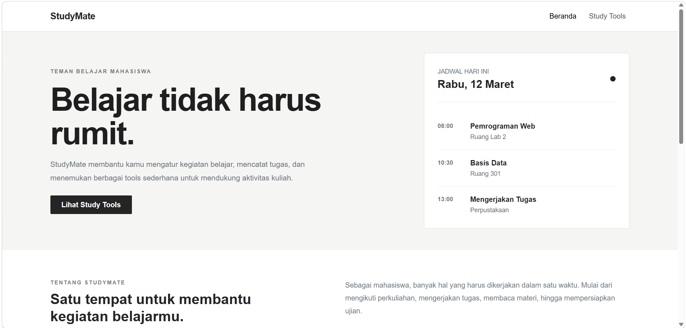
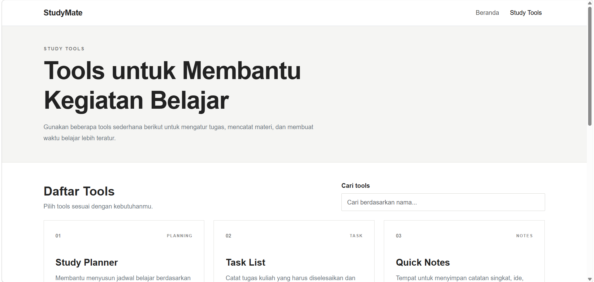

# StudyMate

StudyMate adalah website sederhana yang dibuat untuk membantu mahasiswa mengatur kegiatan belajar dan menemukan berbagai tools yang dapat digunakan untuk mendukung aktivitas akademik.

Website ini dibuat sebagai mini project dengan menggunakan HTML Native, Bootstrap, dan Basic JavaScript.

## Preview

### Halaman Beranda

### Halaman Study Tools

## Fitur

- Halaman Beranda
- Halaman Study Tools
- Navigasi antar halaman
- Daftar study tools
- Pencarian study tools
- Detail tools menggunakan modal
- Tampilan responsive
- Layout yang dapat menyesuaikan ukuran layar

## Teknologi

- HTML5
- Bootstrap 5.3
- CSS3
- JavaScript

## Komponen Bootstrap

Beberapa komponen Bootstrap yang digunakan dalam website ini antara lain:

- Navbar
- Button
- Modal
- Grid System
- Form
- Responsive Utilities